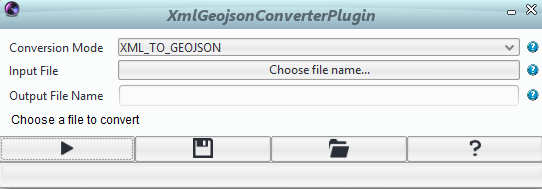

# XML and GeoJSON Converter for Icy Plugin

<!-- badges: start -->

<!-- badges: end -->

This repository contains the source code for the **XML and GeoJSON Converter** plugin for the [Icy bioimage analysis software](http://icy.bioimageanalysis.org/).  

Icy is developed and maintained by the same unit, and its [source code](https://gitlab.pasteur.fr/bia/icy) is also GPLv3.

## Plugin Description

The **XML and GeoJSON Converter** plugin allows users to convert annotation files between XML and GeoJSON formats directly within Icy.  
It is useful for interoperability between tools that use different annotation formats, especially for QuPath users who need to convert their annotations for use in Icy or vice versa.

- **Convert XML to GeoJSON**: Select an XML file and convert it to GeoJSON.
- **Convert GeoJSON to XML**: Select a GeoJSON file and convert it to XML.
- The plugin automatically handles file naming and extensions.
- Input and output file names are validated for correctness.

## Installation Instructions

For end-users, refer to the [Icy plugin installation guide](http://icy.bioimageanalysis.org/tutorial/how-to-install-an-icy-plugin/).

For developers, see the [Contributing guidelines](https://gitlab.pasteur.fr/bia/icy/icy/-/blob/master/CONTRIBUTING.md) and [Code of Conduct](https://gitlab.pasteur.fr/bia/icy/icy/-/blob/master/CODE-OF-CONDUCT.md).

## Main Functions and Usage

- **Classname:** `plugins.thardy.xmlgeojsonconverterplugin.XmlGeojsonConverterPlugin`
- **How to use:**
  1. Open the plugin from the Icy interface.
  2. Choose the conversion mode: XML to GeoJSON or GeoJSON to XML.
  3. Select the input file. The plugin checks the file extension for compatibility.
  4. Specify the output file name (optional). If not specified, the plugin will use the input file name with the appropriate extension.
  5. Run the conversion. The plugin will notify you of success or any errors.

## Citation

- de Chaumont, F. et al. (2012) Icy: an open bioimage informatics platform for extended reproducible research, [Nature Methods](https://www.nature.com/articles/nmeth.2075), 9, pp. 690-696  
http://icy.bioimageanalysis.org  

## Author(s)

- [Théo HARDY](https://github.com/TheHardy04) for Institut Pasteur

## Additional Information

For questions or issues, please use the [Icy forum](https://forum.image.sc/tag/icy) or open an issue on this repository.
